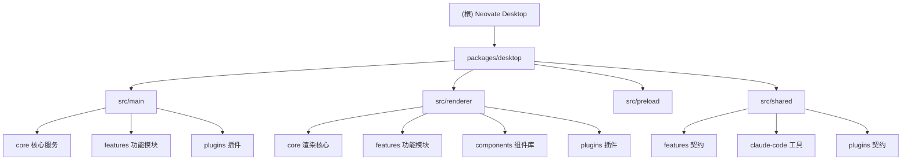

# Neovate Desktop

> 最后更新: 2026-04-28 14:56:13 | 架构师版本: v2 (Mermaid + 模块索引 + 覆盖率报告)

## 变更记录 (Changelog)

| 日期 | 变更 |
|------|------|
| 2026-04-28 | 初始化 AI 上下文文档：添加 Mermaid 架构图、模块索引表、preload 模块文档、完善 main/renderer/shared 模块文档 |
| 2026-04-28 (之前) | 原有 CLAUDE.md 含项目信息、架构概览、进程边界、编码规范、设计上下文 |

---

## 项目愿景

Neovate Desktop 是面向专业开发者的 AI 辅助编码桌面客户端。以 **Electron + React 19 + oRPC** 构建，强调效率、速度、控制。界面风格极简、安静、优雅，致敬 iA Writer 和 Things。

## 项目信息

- **类型**: Electron 桌面应用 (monorepo, 主包在 `packages/desktop/`)
- **设置目录**: `~/.neovate-desktop`
- **包管理器**: `bun` (v1.3.10)
- **Node 版本**: 跟随 Electron 40.x
- **仓库**: `git@github.com:neovateai/neovate-desktop.git`

## 架构总览

### 进程架构

```
┌─────────────────────────────────────────────────────────────┐
│                      Electron App                            │
│                                                              │
│  ┌──────────┐    oRPC/MessagePort    ┌──────────────────┐   │
│  │  main     │◄──────────────────────►│  renderer         │   │
│  │  Node.js  │                        │  React 19 SPA     │   │
│  │           │                        │                   │   │
│  │  - IPC    │    contextBridge       │  - Zustand stores │   │
│  │  - ACP    │◄──────────────────────►│  - Tailwind CSS 4 │   │
│  │  - 插件   │      preload           │  - shadcn/ui      │   │
│  └──────────┘                        └──────────────────┘   │
│       │                                                      │
│       │ oRPC contracts                                       │
│       ▼                                                      │
│  ┌──────────────────────────────────────────────────┐       │
│  │  shared/  (类型 + Zod schema + 工具解析器)         │       │
│  └──────────────────────────────────────────────────┘       │
└─────────────────────────────────────────────────────────────┘
```

### 模块结构图



### 模块索引

| 模块 | 路径 | 职责 | 语言 | 入口文件 |
|------|------|------|------|----------|
| **main** | `packages/desktop/src/main/` | Electron 主进程：生命周期、IPC、ACP、插件 | TypeScript | `index.ts` |
| **renderer** | `packages/desktop/src/renderer/src/` | React 19 SPA：全部 UI | TypeScript/React | `main.tsx` |
| **preload** | `packages/desktop/src/preload/` | Context bridge、MessagePort 转发 | TypeScript | `index.ts` |
| **shared** | `packages/desktop/src/shared/` | oRPC 契约、Zod schema、共享类型 | TypeScript | `contract.ts` |

## 进程边界 (重要!)

- **禁止** renderer 代码中 import `src/main/` 或 `electron`
- **禁止** main 代码中 import renderer 代码
- 唯一共享代码在 `src/shared/`
- `electron-vite` 在构建时强制检查这些边界

## IPC 通信

**协议**: oRPC over MessagePort

```
[renderer/orpc.ts] ──MessageChannel──> [preload/index.ts] ──ipcRenderer.postMessage──> [main/index.ts]
      clientPort                                (forward)                              RPCHandler
```

**添加新 IPC 方法**:
1. 在 `src/shared/features/<domain>/contract.ts` 定义契约（Zod schema）
2. 在 `src/main/features/<domain>/router.ts` 实现处理器
3. 在 renderer 中通过 `client.<domain>.<method>()` 调用

## main 主进程内部架构

```
src/main/
├── index.ts              # 入口：初始化所有服务、注册 IPC、启动应用
├── app.ts                # MainApp 类：生命周期管理
├── router.ts             # 根 oRPC 路由：聚合所有 feature router + 插件 router
├── core/                 # 核心服务
│   ├── app-paths.ts      # 应用数据路径
│   ├── browser-window-manager.ts  # 窗口管理
│   ├── deeplink/         # Deeplink 协议处理
│   ├── menu.ts           # 应用菜单
│   ├── plugin/           # 插件系统（MainPlugin 接口）
│   ├── shell-service.ts  # Shell 环境
│   ├── storage-service.ts # electron-store 封装
│   └── power-blocker-service.ts  # 电源管理
├── features/             # 功能模块（每个有 router.ts + store/service）
│   ├── agent/            # Claude Agent SDK 会话管理（核心模块）
│   ├── claude-code-plugins/ # Claude Code 插件市场集成
│   ├── config/           # 配置存储
│   ├── electron/         # Electron 原生操作
│   ├── llm/              # 辅助 LLM 查询
│   ├── popup-window/     # 全局快捷键弹出窗口
│   ├── project/          # 项目管理
│   ├── provider/         # AI Provider 管理
│   ├── remote-control/   # 远程控制（钉钉/Telegram/微信）
│   ├── rules/            # 规则管理
│   ├── skills/           # 技能安装与管理
│   ├── state/            # 全局状态持久化
│   ├── storage/          # 通用键值存储
│   ├── updater/          # 自动更新
│   └── utils/            # 工具功能
└── plugins/              # 内置插件 (MainPlugin)
    ├── browser/
    ├── changes/
    ├── editor/
    ├── files/
    ├── git/
    └── terminal/
```

## renderer 渲染进程内部架构

```
src/renderer/src/
├── main.tsx              # 入口：创建 RendererApp
├── App.tsx               # 主窗口 App 组件
├── orpc.ts               # oRPC 客户端（MessageChannel 初始化）
├── core/                 # 渲染核心
│   ├── app.tsx           # RendererApp 类 + React providers
│   ├── plugin/           # 插件系统（RendererPlugin 接口）
│   ├── i18n/             # 国际化
│   ├── disposable.ts     # 资源释放
│   ├── deeplink/         # Deeplink 订阅
│   └── workbench/        # 工作台布局服务
├── features/             # 功能模块
│   ├── agent/            # AI 聊天核心（会话 UI、消息渲染、工具展示）
│   ├── analytics/        # 埋点追踪
│   ├── claude-code-plugins/ # 插件管理 UI
│   ├── command-palette/  # 命令面板
│   ├── config/           # 配置 store
│   ├── content-panel/    # 内容面板（Tab 管理）
│   ├── open-in/          # 外部打开
│   ├── project/          # 项目选择器
│   ├── provider/         # Provider 管理 + Benchmark
│   ├── settings/         # 设置页面
│   ├── skills/           # 技能管理 UI
│   └── updater/          # 更新提示
├── components/           # UI 组件
│   ├── ui/               # shadcn/ui 组件（80+ 个，禁止手动编辑）
│   ├── ai-elements/      # AI 专用组件（消息、工具渲染等）
│   └── app-layout/       # 应用布局组件
├── hooks/                # 通用 hooks
└── plugins/              # 内置插件 (RendererPlugin)
    ├── browser/          # 浏览器
    ├── changes/          # 变更查看
    ├── debug/            # 调试
    ├── editor/           # 代码编辑器
    ├── files/            # 文件浏览器
    ├── git/              # Git 集成
    ├── network/          # 网络监控
    ├── popup-window/     # 弹出窗口
    ├── providers/        # Provider 配置
    ├── search/           # 搜索
    └── terminal/         # 终端
```

## 数据流

```
用户输入 (TipTap 编辑器)
    │
    ▼
[agent/store.ts] ──────────────────────────────────────────
    │ sendMessage() → client.agent.claudeCode.createSession()
    │              → client.agent.claudeCode.send()
    │              → client.agent.claudeCode.subscribe()  ← 流式事件
    ▼
[oRPC client] ──MessagePort──> [preload] ──IPC──> [main/RPCHandler]
    │                                                    │
    │                                                    ▼
    │                                          [main/agent/session-manager.ts]
    │                                                    │
    │                                          Claude Agent SDK (ACP 子进程)
    │                                                    │
    ▼                                                    ▼
[process-ui-message-stream.ts]  ◄── 流式 UI 事件 ─────────┘
    │
    ▼
React 组件渲染 (agent-chat.tsx → message-parts.tsx → tool-parts/*.tsx)
```

## 持久化

- **存储引擎**: `electron-store` (JSON 文件存储)
- **封装**: `StorageService.scoped(namespace)` — namespace 隔离
- **数据目录**: `~/.neovate-desktop/` (生产) / `~/.neovate-desktop-dev/` (开发)
- **主要 namespace**:
  - `config` — 应用配置
  - `projects` — 项目列表与状态
  - `state` — 全局 UI 状态
  - `contentPanel/projects` — 内容面板 Tab 状态
  - 各插件自行管理 namespace

## 运行与开发

| 命令 | 用途 |
|------|------|
| `bun dev` | 启动开发服务器 (HMR) |
| `bun check` | typecheck + lint + format check |
| `bun test:run` | 运行单元测试 (vitest) |
| `bun test:e2e` | 运行 E2E 测试 (playwright) |
| `bun ready` | 完整预推送检查 |
| `bun lint` | oxlint 检查 |
| `bun format` | oxfmt 格式化 |
| `bun build` | 生产构建 |
| `bun build:mac` | macOS 生产构建 + 签名打包 |

**开发环境**:
- `bun dev` 启动 electron-vite，支持 main/preload/renderer 三进程 HMR
- 开发时需先运行 `bun run build:interceptor` 编译 fetch 拦截器
- `react-grab` 和 `react-scan` 在 DEV + developerMode 下可用

## 测试策略

| 类型 | 工具 | 位置 | 运行 |
|------|------|------|------|
| 单元测试 | vitest | `__tests__/` (colocated) | `bun test:run` |
| 类型测试 | vitest typecheck | 内联 | `bun check` |
| E2E 测试 | Playwright | `packages/desktop/test/` | `bun test:e2e` |

- 测试文件与源文件 colocated，命名 `*.test.ts` / `*.test.tsx`
- vitest 配置在 `packages/desktop/vitest.config.ts`
- 集成测试用 `*.integration.test.ts` 命名

## 编码规范

- **提交**: Conventional Commits (`feat:`, `fix:`, `chore:`)
- **Linter**: oxlint (NOT eslint)
- **Formatter**: oxfmt (NOT prettier)
- **TypeScript**: v5.9+，使用 `@typescript/native-preview` (tsgo) 做类型检查
- **相对导入**: Renderer 中使用相对路径（无 `@/` 别名）
- **Debug 日志**: `import debug from "debug"` 使用 `neovate:` 命名空间前缀
- **校验**: Zod 4 schema 在 shared contracts 中定义
- **插件模式**: `MainPlugin` 接口在 `src/main/core/plugin/types.ts`
- **状态管理**: `create<State>()(immer((set, get) => ({ ... })))`
- **禁止修改**: `components/ui/` 文件由 shadcn 生成，通过 `/coss-ui-sync` skill 操作
- **import 顺序**: oxfmt 自动排序（type imports 优先，按组分类）

## UI 组件层级

```
components/ui/          ← shadcn/ui 基础组件 (80+)，通过 coss-ui-sync 同步
components/ai-elements/ ← AI 专用组件：消息气泡、工具渲染、推理链等
components/app-layout/  ← 应用布局：侧边栏、活动栏、面板系统
features/*/components/  ← 各功能模块业务组件
```

## 库选择 (不可替换)

- 动画: `motion` (非 framer-motion)
- Headless UI: `@base-ui/react` (非 radix)
- Linter: `oxlint` (非 eslint)
- Formatter: `oxfmt` (非 prettier)
- CSS: Tailwind CSS 4 (CSS-first, 无 tailwind.config.js)
- 校验: Zod 4 (非 zod 3)
- 图标: `lucide-react` (通用), `@hugeicons/core-free-icons` (侧边栏/插件)
- 编辑器: TipTap 3
- 终端: xterm.js 6
- Markdown: streamdown
- 拖拽: @dnd-kit
- Diff: @pierre/diffs

## 设计上下文

### 用户画像

每日使用 AI 辅助编码工具的专业开发者。重视效率、速度和掌控感。

### 品牌调性

**极简、安静、优雅**。类似 iA Writer 或 Things 的低调精致。主色 `#fa216e` 作为唯一强调色。

### 设计原则

1. **安静的自信** — UI 应冷静而有权威
2. **开发者优先的密度** — 尊重屏幕空间
3. **单一强调色** — `#fa216e` 仅用于主操作和关键交互
4. **有目的的动效** — 帮助追踪状态变化
5. **一致的原语** — 基于 shadcn/base-ui 组件库

## AI 使用指引

- 修改前先阅读相关模块的 `CLAUDE.md`
- 完成代码修改后运行 `bun ready`
- 不要手动编辑 `components/ui/` 下的文件
- 遵守进程边界：main/renderer/shared 代码严格隔离
- 新增 IPC 方法遵循三文件模式 (contract → router → client call)
- 测试与源文件 colocated

## 相关文件

- `packages/desktop/electron.vite.config.ts` — 构建配置
- `packages/desktop/vitest.config.ts` — 测试配置
- `packages/desktop/playwright.config.ts` — E2E 配置
- `packages/desktop/components.json` — shadcn/ui 配置
- `.oxfmtrc.json` — 格式化规则
- `bunfig.toml` — bun 配置
- `scripts/ready.ts` — 预推送检查脚本
